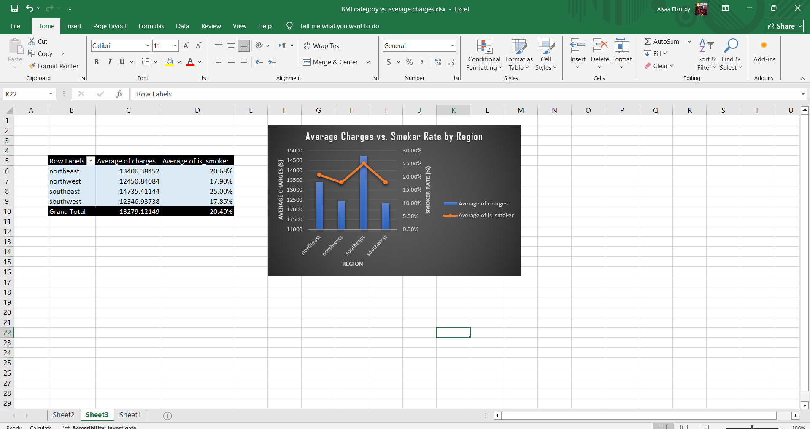

# Business Question 2: How Do Regions Rank by Average Charges?

## The Idea

We wanted to find out: is there a specific geographic region (out of the four: northeast, northwest, southeast, southwest) that costs us more than the others in average medical charges? The goal was to see whether pricing or insurance plans need to differ by region.

## Steps

1. Built a PivotTable in Excel, with `region` in Rows and `charges` in Values (using Average, not Sum).
2. Confirmed the same result again in Python (pandas `groupby`), to make sure the numbers were correct and there was no error in the Pivot.
3. The numbers matched 100% between the two — meaning the result is reliable and there's no need to doubt the Pivot's accuracy.
4. We felt that the number alone ("Southeast has the highest charges") wasn't enough — we needed to understand *why*. We suspected smoking might be the reason (based on a finding from another question in the project showing smoking is the strongest driver of cost).
5. To test this idea, we created a new column in the data called `is_smoker`: value 1 if the patient smokes (`smoker = yes`) and 0 if not. This column converts the text value (yes/no) into a number, so we could calculate the "average" smoking rate per region (averaging 1s and 0s directly gives a percentage).
6. Built a second PivotTable, this time with `region` in Rows, and added two Values together: `Average of charges` and `Average of is_smoker` — so we could see both on the same table.
7. From the same Pivot, created a combo PivotChart: the columns represent average charges, and the line represents smoker rate, on the same chart so we could compare them visually at a glance.

## What We Gained From Each Step

- The Python step (step 2) saved us time — if there had been an error in the Pivot, we would have caught it immediately from the mismatch between the two results.
- The `is_smoker` column (step 5) is what let us connect our question (regions) to the smoking question, turning the result from an isolated number into part of a bigger picture of the project.
- The combo chart (step 7) made the relationship between charges and smoker rate clear at a glance, instead of the reader having to compare two separate tables mentally.

## Problems We Ran Into

The first time we built the region PivotChart, an extra category called "(blank)" showed up in the chart — we found the cause was an empty row in the original data. It was fixed by deleting the empty rows and refreshing the Pivot.

## Results

| Region | Avg Charges | Patients |
|---|---|---|
| **Southeast** | **$14,735.41** | 364 |
| Northeast | $13,406.38 | 324 |
| Northwest | $12,450.84 | 324 |
| Southwest | $12,346.94 | 325 |

These numbers matched exactly between Excel and Python, so there's no doubt about their accuracy.

## Visualizations

### Average Charges by Region

### Average Charges vs. Smoker Rate by Region

## Conclusion

**Southeast** is the region with the highest average medical charges ($14,735.41), notably higher (~$1,300) than the next closest region (Northeast). The remaining three regions (Northeast, Northwest, Southwest) are relatively close to each other (less than $1,100 apart).

It's also worth noting that Southeast has the largest number of patients (364 out of 1337) compared to the other regions (~324-325 each), meaning the result is based on a relatively large sample and isn't a statistical fluke caused by a small number of patients.

When we added the smoker rate per region, we found that **Southeast also has the highest smoker rate (25%)**, compared to 17.8%–20.7% in the other regions. This provides a strong explanation for why Southeast has higher costs: it's not just the "region" itself that's the cause, but the higher concentration of smokers within it — consistent with the project's overall finding that smoking is the strongest driver of medical costs.

## Files

- `sql/queries/q2_avg_charges_by_region.sql`
- `notebooks/Q2_avg_charges_by_region.ipynb`
- `reports/region_charges_vs_smoker_rate.xlsx`
- `reports/average_charges_by_region.jpeg`
- `reports/region_charges_vs_smoker_rate.png`
